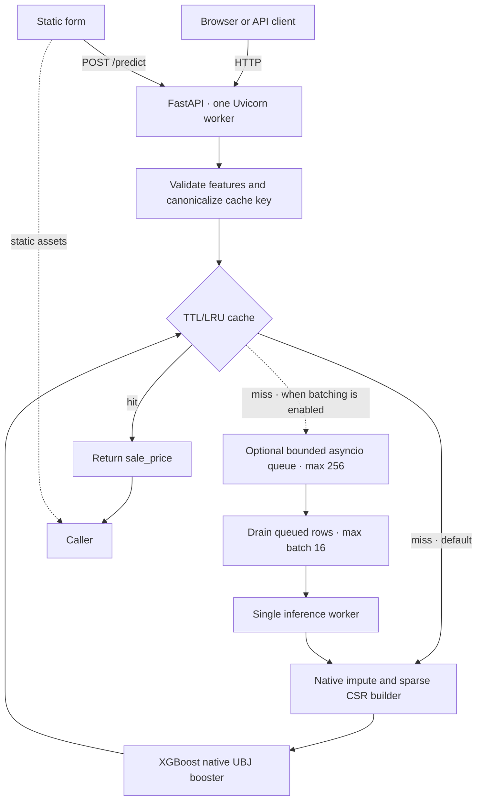

# Phase 3 — Architectural Scaling and Optimization

**Course:** SYS-304 Scalable Algorithms and Infrastructure  
**Project:** House Prices (Ames)  
**Measurement date:** 2026-09-27  

## Goal and outcome

Phase 3 required at least two optimization techniques in each of two weeks, with model inference and system behavior benchmarked against the Phase 2 service. This implementation keeps the Phase 2 fitted model and feature schema fixed, exports the model to a native inference archive, and adds caching plus an optional dynamic batching path. The selected default is native inference with caching; batching is disabled by default because its isolated ablation reduced throughput in both tested workloads.

## Superseded implementation

The historical Phase 3 pickle, `models/optimized_xgb_pipeline.pkl`, used domain feature engineering, a `log1p(SalePrice)` target, and a scikit-learn serving pipeline. It is retained only as a comparison point in `model_training/benchmark_models.py` and `benchmarks/model_benchmark.json`; the API never loads it and deployment does not rebuild it. Its slower inference and extra preprocessing work explain the move to the native export of the frozen Phase 2 model. The old training, model-family, notebook, and PDF-builder files are not part of the current serving or Markdown-report workflow.

## Methodology

The Phase 2 and Phase 3 systems were evaluated with the same input records on the same machine. Only successful requests were included in the latency and throughput calculations, and all measurements were collected locally from fresh API processes or local inference runs. This keeps the comparison focused on implementation changes under the same test conditions.

## Architecture



The exact-input cache is process-local, and concurrent identical misses share one in-flight prediction. On the default path, a cache miss runs directly through native inference. When `DYNAMIC_BATCHING_ENABLED=1`, misses instead enter the bounded queue and are grouped before inference. The measured workload did not show a reliable batching gain, so Compose and the application default keep that path disabled. Compose runs one API worker so cache state and, when enabled, queue state are shared.

Two Uvicorn workers are a possible deployment setting for more process-level concurrency on a multi-core host. They do not share the process-local cache, in-flight map, or batch queue, and each worker loads its own model and runtime. That can improve concurrency when one process is saturated, but it also increases memory use and can reduce cache sharing and batch fill. This report did not include a two-worker run, so `WEB_CONCURRENCY=1` remains the measured default; a two-worker deployment should be benchmarked against the expected traffic mix before adoption.

## Techniques mapped to the assignment

| Week | Technique | Implementation and purpose |
|---|---|---|
| 5 — model | Fuse fitted preprocessing into native inference | backend/native_model.py applies saved imputers and category mappings, creates sparse CSR input, and skips pandas/scikit-learn/joblib in the runtime path. |
| 5 — model | Native XGBoost model format | model_training/export_native.py exports the frozen booster as UBJ and packages it with preprocessing metadata in models/house_prices_native.zip. |
| 6 — infrastructure | Bounded TTL/LRU cache and in-flight coalescing | Repeated exact requests avoid inference; simultaneous duplicate misses share work. This is enabled by default and is process-local. |
| 6 — infrastructure | Bounded dynamic batching, opt-in | Queued requests can be predicted together up to 16 rows; queue capacity is 256. It is disabled by default after the measured ablation showed lower throughput. |

The assignment's “at least two optimizations per week” requirement is met with two model-level and two infrastructure-level techniques. CPU-only packaging is a deployment choice that supports the runtime design.

## Model benchmark

Each artifact was loaded in a fresh process. Timed prediction calls received the same prebuilt raw feature-record dictionaries; the pickle paths construct a DataFrame inside prediction while the native path consumes records directly. RSS was sampled separately during an untimed repeated-prediction pass. The Phase 3 pickle is included as a historical reference; it is not the serving model.

| Artifact | One-row p50 | 64-row p50 | 64-row throughput | Loaded RSS | Active sampled RSS | On-disk size |
|---|---:|---:|---:|---:|---:|---:|
| Frozen Phase 2 pickle | 22.13 ms | 23.82 ms | 2,674.63 rows/s | 284.4 MB | 372.0 MB | 492,927 B |
| Historical Phase 3 pickle | 35.59 ms | 35.65 ms | 1,710.98 rows/s | 282.4 MB | 373.6 MB | 69,313 B |
| Native UBJ + preprocessing ZIP | 0.53 ms | 4.50 ms | 13,298.01 rows/s | 276.1 MB | 278.8 MB | 95,850 B |

Native prediction was 41.7× faster for one-row calls, 5.3× faster for 64-row calls, and processed 4.97× as many rows per second for the 64-row workload. The uncompressed baseline is 492,927 bytes; when wrapped with the same ZIP DEFLATE level 9 used for the native archive, it is 102,904 bytes. The native archive is therefore only 7,054 bytes (about 6.9 KiB) smaller than an equally compressed baseline. Size is secondary; speed is the primary result.

| Artifact | Holdout MAE | Holdout RMSE | Holdout R² | Holdout RMSLE |
|---|---:|---:|---:|---:|
| Frozen Phase 2 pickle | $15,159.68 | $24,338.93 | 0.92277 | 0.13270 |
| Historical Phase 3 pickle | $15,929.26 | $27,148.85 | 0.90391 | 0.13129 |
| Native export of Phase 2 | $15,159.68 | $24,338.93 | 0.92277 | 0.13270 |

These are descriptive metrics from the existing `random_state=42` 20% holdout and show that the export preserves baseline behavior. Baseline/native parity covered 2,919 rows (1,460 training and 1,459 test rows): maximum absolute prediction difference was 0, with 0 rows returning a different rounded-cent price. The model benchmark independently checked 1,460 training rows with the same exact result. The exporter also checks partial, missing, reordered, zero, and unknown-category inputs. The original baseline hash (`0eed717d…c9c26d42`) and feature-schema hash (`15c7bd2c…9758818a`) remained unchanged.

The benchmark used 100 repeated calls per trial across three trials, single-threaded model settings, and 30 untimed memory samples per batch size. For the 64-row workload, the native median was 4.50 ms per call versus 23.82 ms for the baseline. Reported process RSS is coarse local Windows process memory and includes the full development environment; it is not trimmed container memory.

## HTTP benchmark

The API benchmark launches a fresh local Uvicorn process per trial, uses persistent HTTP connections, and reports request p50/p95/p99, successful throughput, process-tree RSS, errors, and cache/batch counters. The formal runs below measure unique payloads and a repeating ten-row hot set; the script also supports a mixed 80/20 stream. Results are medians across three trials.

### End-to-end comparison

| Workload | Concurrency | System / role | p50 | p95 | Successful req/s | Errors |
|---|---:|---|---:|---:|---:|---:|
| Unique | 1 | Phase 2, uncached | 28.48 ms | 47.73 ms | 32.23 | 0 |
| Unique | 1 | Native cache only, chosen default | 3.39 ms | 14.78 ms | 170.50 | 0 |
| Unique | 1 | Native cache + batching, candidate | 3.75 ms | 14.82 ms | 187.28 | 0 |
| Unique | 32 | Phase 2, uncached | 654.45 ms | 966.61 ms | 44.54 | 0 |
| Unique | 32 | Native cache only, chosen default | 172.36 ms | 670.28 ms | 100.99 | 0 |
| Unique | 32 | Native cache + batching, candidate | 130.85 ms | 760.10 ms | 103.91 | 0 |
| Repeated | 1 | Phase 2, uncached | 25.31 ms | 39.15 ms | 35.35 | 0 |
| Repeated | 1 | Native cache only, chosen default | 2.89 ms | 20.72 ms | 170.52 | 0 |
| Repeated | 1 | Native cache + batching, candidate | 2.37 ms | 13.68 ms | 286.27 | 0 |
| Repeated | 32 | Phase 2, uncached | 714.65 ms | 945.70 ms | 43.26 | 0 |
| Repeated | 32 | Native cache only, chosen default | 164.59 ms | 705.11 ms | 113.60 | 0 |
| Repeated | 32 | Native cache + batching, candidate | 125.13 ms | 772.62 ms | 100.33 | 0 |

Each entry is the median across three trials of 160 requests per trial. Phase 2 and `native_full` results are from `api_benchmark.json`; the chosen-default concurrency-1 results are from `api_selected_default.json`, and its concurrency-32 results are from the cache-only arm of `api_ablation.json`. These are local measurements from separate runs. The full-stack candidate was faster at concurrency 1, while concurrency-32 results were mixed: it slightly improved unique throughput and reduced repeated throughput compared with cache-only. The Windows-host load generator and server shared the same machine, so the measurements show local comparisons, not capacity scaling.

The repeated workload reached a 93.75% cache-hit ratio in the full-stack candidate; the unique workload had no cache hits. Across those candidate trials, the batching dispatcher processed 1,020 inference rows in 1,012 batches, averaging about one row per batch. The isolated ablation below showed lower throughput for batching alone in both workloads, so it does not establish a reliable batching gain for this traffic pattern. The cache-only default retains the repeated-request benefit without enabling the inconclusive queue path.

### Cache and batching ablation

The ablation runs each native configuration at concurrency 32 with 160 requests per trial across three trials. This isolates the feature toggles but is a small local run, and its results are noisy.

| Workload | Configuration | p50 | p95 | Successful req/s | Errors |
|---|---|---:|---:|---:|---:|
| Unique | Native, neither | 147.02 ms | 679.13 ms | 105.83 | 0 |
| Unique | Native, batching only | 194.00 ms | 1,002.99 ms | 81.05 | 0 |
| Unique | Native, cache only | 172.36 ms | 670.28 ms | 100.99 | 0 |
| Repeated | Native, neither | 171.50 ms | 694.48 ms | 103.63 | 0 |
| Repeated | Native, batching only | 153.29 ms | 844.60 ms | 93.46 | 0 |
| Repeated | Native, cache only | 164.59 ms | 705.11 ms | 113.60 | 0 |

In this run, cache-only throughput was slightly lower than plain native inference on unique requests and higher on repeated requests. Batching alone reduced throughput in both workloads: 81.05 versus 105.83 requests/s for unique requests and 93.46 versus 103.63 requests/s for repeated requests. It also had higher p95 latency than plain inference in both cases. The measured evidence therefore supports native inference with caching as the default and dynamic batching as opt-in. These settings should be evaluated against a real traffic distribution before production use.

### Process-tree memory

| Configuration | Trials | Loaded RSS, mean | Peak sampled RSS, mean |
|---|---:|---:|---:|
| Phase 2, uncached | 12 | 281.2 MiB | 295.4 MiB |
| Native cache only, chosen default | 6 | 274.4 MiB | 275.0 MiB |
| Native cache + batching, candidate | 12 | 273.8 MiB | 276.1 MiB |

These local process-tree measurements are approximate and include development dependencies. They are not a measurement of the Docker image's memory footprint.

Unique requests test inference, while repeated requests test cache benefit. Batching was assessed separately in the ablation. Throughput and tail latency depend on concurrency, so these local measurements do not imply a production service-level objective. Across the 48 recorded API trials (7,680 requests), all requests succeeded.

## Deployment and limitations

The native artifact reproduces the frozen Phase 2 pipeline and schema. It changes inference format and the serving preprocessing path, not the trained model or accuracy. The backend image uses backend/requirements-runtime.txt, selecting CPU-only XGBoost on amd64 Linux and regular XGBoost elsewhere. Docker Compose defaults to one Uvicorn worker and one inference worker. Cache state is process-local; the optional batch queue is created only when batching is enabled. Additional Uvicorn workers would have independent model instances, cache and queue state, so increasing `WEB_CONCURRENCY` trades memory and cache sharing for process-level concurrency.

The Windows host had no available Docker engine during this work. Docker image build and container execution are unverified; Compose configuration and application behavior were checked independently. The reported RSS comes from local Python processes, not from a trimmed image. These local single-thread measurements are comparisons, not production capacity guarantees.

## Reproduction

From the repository root in the sys-304 environment:

```powershell
python -m model_training.export_native
python model_training/benchmark_models.py --repeats 100 --trials 3 --memory-samples 30
python model_training/benchmark_api.py --configs phase2_uncached native_full --workloads unique repeated --concurrency 1 32 --requests 160 --trials 3 --output benchmarks/api_benchmark.json
python model_training/benchmark_api.py --configs native_plain native_batch native_cache --workloads unique repeated --concurrency 32 --requests 160 --trials 3 --output benchmarks/api_ablation.json
python model_training/benchmark_api.py --configs native_cache --workloads unique repeated --concurrency 1 --requests 160 --trials 3 --output benchmarks/api_selected_default.json
ruff check backend tests model_training/*.py
pytest -q
docker compose config
```

Native export regenerates the archive and checks full-row and edge-case prediction parity. The model benchmark writes `benchmarks/model_benchmark.json`; the main HTTP comparison writes `benchmarks/api_benchmark.json`; the cache/batching ablation writes `benchmarks/api_ablation.json`; and the selected-default run writes `benchmarks/api_selected_default.json`. Each file retains per-trial samples, environment details, and summaries. Defaults are dynamic batching disabled, zero collection delay when enabled, batch size 16, queue size 256, one inference worker, cache capacity 1024, and 300-second TTL.

## Measurement limits

- Measurements are from one Windows development host with single-threaded XGBoost; they are comparative local measurements, not a production load test.
- RSS includes the development environment and is not a container memory limit.
- No Docker engine was available, so image build and execution are unverified.
- This repository contains the report in Markdown; no combined PDF was generated.
- Retraining still uses full development dependencies and writes a separate pipeline artifact.
- Cache and batch queue are local to one API process and do not coordinate across workers or hosts.

XGBoost documents the stable model-saving formats and its CPU installation packages in the [model IO guide](https://xgboost.readthedocs.io/en/stable/tutorials/saving_model.html) and [installation guide](https://xgboost.readthedocs.io/en/latest/install.html). The archive uses UBJ for the booster and the CPU package only on amd64 Linux.

## Interpretation

The native export with the process-local cache is the preferred default: it substantially reduces model and end-to-end latency and increases throughput, while reducing the compressed artifact only modestly. Dynamic batching remains opt-in because the ablation did not improve throughput for this workload. These results support the selected local deployment design, but they should not be treated as a production capacity guarantee.

